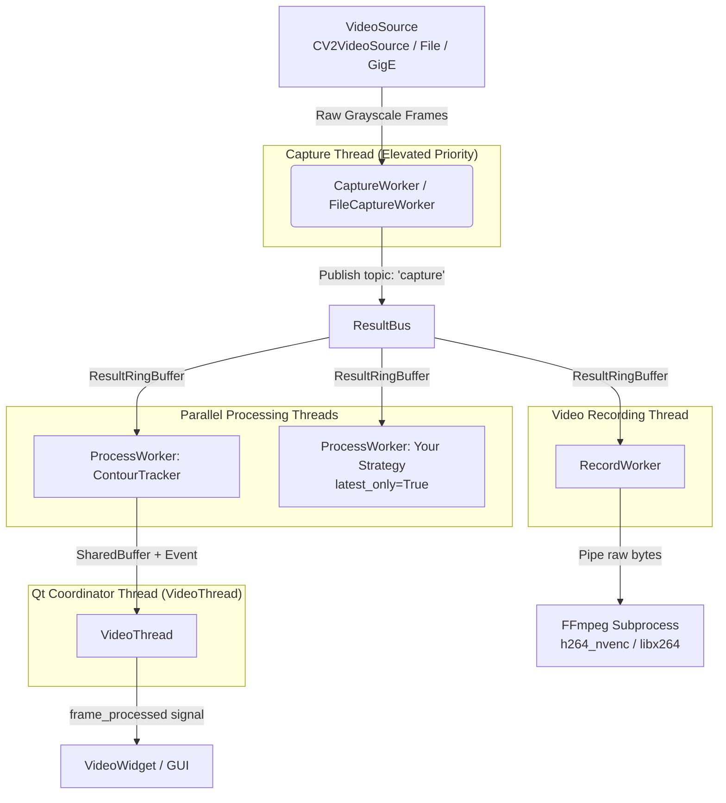

# Video Processing Pipeline — Architecture & Developer Guide

This document describes the multi-threaded video processing pipeline introduced in the
`video_multithreading` refactor and explains how to use or extend it when building new
paradigms.

---

## Table of Contents

1. [Overview](#overview)
2. [Architecture](#architecture)
   - [Thread Topology](#thread-topology)
   - [Data-Flow Diagram](#data-flow-diagram)
   - [Key Classes](#key-classes)
3. [Thread-Safety Primitives](#thread-safety-primitives)
   - [ResultBus (pub/sub)](#resultbus-pubsub)
   - [ResultRingBuffer](#resultringbuffer)
   - [SharedBuffer (point-to-point)](#sharedbuffer-point-to-point)
4. [Built-In Workers](#built-in-workers)
   - [CaptureWorker / FileCaptureWorker](#captureworker--filecaptureworker)
   - [ContourTracker](#contourtracker)
   - [ProcessWorker](#processworker)
   - [RecordWorker](#recordworker)
5. [VideoThread — The Coordinator](#videothread--the-coordinator)
6. [Using the Pipeline in a Paradigm](#using-the-pipeline-in-a-paradigm)
   - [Default usage (no custom workers)](#default-usage-no-custom-workers)
   - [Adding a custom downstream worker](#adding-a-custom-downstream-worker)
   - [Chaining workers (fan-out)](#chaining-workers-fan-out)
7. [Writing a Strategy](#writing-a-strategy)
   - [Strategy interface](#strategy-interface)
   - [Minimal example](#minimal-example)
   - [Stateful strategy example](#stateful-strategy-example)
8. [Registering a Worker at Runtime](#registering-a-worker-at-runtime)
9. [VideoSource — Swapping the Camera Backend](#videosource--swapping-the-camera-backend)
10. [Performance Notes & Tuning](#performance-notes--tuning)
11. [Benchmark Tool](#benchmark-tool)
12. [Module Reference](#module-reference)

---

## Overview

Before this refactor, the `VideoThread` class ran the entire video lifecycle — frame capture,
image masking, contour detection, HDF5 bookkeeping, disk recording, and Qt signal emission —
sequentially in a single loop. Any slowdown in one stage backpressured the entire pipeline and
caused dropped frames.

The refactored pipeline decomposes each responsibility into an isolated class that runs in its
own `threading.Thread`. Stages communicate asynchronously via a thread-safe publish/subscribe
bus (`ResultBus`). The `VideoThread` becomes a thin Qt coordinator: it starts/stops worker
threads and drains result buffers to emit signals on the Qt thread, where they are safe to
connect to GUI widgets.

**Benchmarked results** (1440×1080, 210 FPS target):

| Configuration | FPS | Drop Rate | Mean Latency | p95 Latency |
|---|---|---|---|---|
| Default (no paradigm) | ~206 | 0.17% | 2.30 ms | 2.90 ms |
| With locomotion paradigm | ~200 | 0.16% | 3.25 ms | 3.87 ms |

Both figures are well within the single-frame interval of 4.76 ms at 210 FPS.

---

## Architecture

### Thread Topology

```
Thread 1 (capture)       Thread 2 (contour tracker)      Thread 3 (your worker)
┌─────────────────┐      ┌──────────────────────────┐    ┌──────────────────────┐
│  CaptureWorker  │──►──►│  ProcessWorker            │    │  ProcessWorker       │
│  (VideoSource)  │      │  strategy: ContourTracker │    │  strategy: your fn   │
└─────────────────┘      └──────────────────────────┘    └──────────────────────┘
        │                         │                                │
        │   ResultBus             │  SharedBuffer                  │  SharedBuffer
        │   topic: 'capture'      │  (+ threading.Event)           │  (+ threading.Event)
        ▼                         ▼                                ▼
  ┌──────────┐          ┌──────────────────────────────────────────────────────────┐
  │ResultBus │          │         VideoThread (QThread coordinator)                │
  └──────────┘          │  drain loop → frame_processed.emit(ts, frame, pts, cnt) │
        │               └──────────────────────────────────────────────────────────┘
        │
        ▼  Thread N (recorder)
  ┌─────────────┐
  │ RecordWorker│──► ffmpeg subprocess (h264_nvenc / libx264)
  └─────────────┘
```

### Data-Flow Diagram



### Key Classes

| Class | Module | Responsibility |
|---|---|---|
| `VideoSource` / `CV2VideoSource` | `videosource` | Abstract camera interface; OpenCV implementation |
| `WorkerResult` | `resultbus` | Generic result container (`timestamp`, `data` dict, `worker_name`) |
| `ResultBus` | `resultbus` | Thread-safe pub/sub fan-out channel |
| `ResultRingBuffer` | `resultbus` | Pre-allocated circular subscriber queue |
| `SharedBuffer` | `resultbus` | Point-to-point result buffer (worker → coordinator) |
| `CaptureWorker` | `videoworkers` | Live camera capture; publishes to `ResultBus` |
| `FileCaptureWorker` | `videoworkers` | File playback capture with rate-limiting and back-pressure |
| `ContourTracker` | `videoworkers` | Default strategy: mask → threshold → contour → centroid |
| `ProcessWorker` | `videoworkers` | Generic pipeline stage; runs any injected strategy callable |
| `RecordWorker` | `videoworkers` | Writes frames to disk via FFmpeg subprocess |
| `VideoThread` | `videomodule` | Qt coordinator: starts workers, drains results, emits signals |
| `VideoInterface` | `videomodule` | Translates centroid positions into state-machine zone events |

---

## Thread-Safety Primitives

### ResultBus (pub/sub)

`ResultBus` is the central message router. Any number of workers can subscribe to any named
topic; any publisher can push to any topic.

```python
from phonotaxis.resultbus import ResultBus, WorkerResult

bus = ResultBus()

# Subscribe: returns a ResultRingBuffer
my_queue = bus.subscribe('capture', maxsize=8)

# Publish: routes to all subscribers of result.worker_name
result = WorkerResult(timestamp=time.time(), data={'frame': frame}, worker_name='capture')
bus.publish(result)

# Consume in subscriber thread
msg = my_queue.get(timeout=0.05)    # blocks; raises queue.Empty on timeout
msg = my_queue.get_nowait()         # non-blocking; raises queue.Empty if empty
```

**Drop-oldest policy**: when a subscriber's `ResultRingBuffer` is full, the oldest unread item
is silently overwritten. This prevents a slow subscriber from blocking the publisher or
accumulating unbounded memory.

### ResultRingBuffer

A pre-allocated circular buffer used internally by `ResultBus`. Direct use is rare, but it
exposes the same queue-like interface:

```python
buf.put_nowait(item)         # write (overwrites oldest if full)
buf.get(timeout=0.05)        # blocking read
buf.get_nowait()             # non-blocking read
buf.empty() / buf.full()     # state queries
```

### SharedBuffer (point-to-point)

Each `ProcessWorker` writes its finished `WorkerResult` into a dedicated `SharedBuffer` so
the `VideoThread` coordinator can poll it without holding any lock across signal emission.

The coordinator injects a shared `threading.Event` into every `SharedBuffer`. When any worker
writes a result, it sets the event, waking the coordinator immediately rather than waiting for
a 50 ms timeout.

```python
from phonotaxis.resultbus import SharedBuffer
import threading

event = threading.Event()
buf = SharedBuffer(capacity=1, event=event)

# Worker thread
buf.try_write_result(result)      # non-blocking; overwrites previous if unread

# Coordinator thread
result = buf.try_read_result()    # returns WorkerResult or None
```

---

## Built-In Workers

### CaptureWorker / FileCaptureWorker

Both workers open a `VideoSource`, read grayscale frames, and publish them to the `ResultBus`
under the topic name `'capture'` (configurable via the `name` parameter).

`FileCaptureWorker` adds:
- **`fps_limit`** — cap playback speed (useful for replay at target FPS).
- **`loop`** — repeat the file automatically.
- **`paused`** — start in a paused state; toggle at runtime via `worker.paused = True/False`.
- **`wait_on_full`** — when `True`, blocks before publishing if any subscriber queue is full.
  Use this for offline analysis where you want zero dropped frames rather than real-time
  throughput.

Both workers set a `ready_event` (`threading.Event`) once the source is successfully opened.
`VideoThread.run()` blocks on this event (5 s timeout) before starting downstream workers.

### ContourTracker

`ContourTracker` is a callable strategy (implements `__call__`) that performs the standard
dark-object tracking pipeline:

1. Apply optional circular or rectangular mask (cached after first computation).
2. Invert the grayscale frame.
3. Apply Gaussian blur to reduce noise.
4. Threshold to produce a binary frame.
5. Apply morphological closing to fill holes in blobs.
6. Find external contours; select the largest one above `minarea`.
7. Compute centroid and orientation via image moments.

**Returns** a `dict` with:
```python
{
    'frame':        np.ndarray,    # display frame (grayscale or binary per mode)
    'points':       ((cX, cY),),   # tuple of tracked centroids
    'contour':      np.ndarray,    # largest contour, or None
    'orientations': (angle,),      # orientation in radians, or (0.0,)
}
```

The `orientations` key is always present, allowing downstream workers (e.g. kinematics) to
consume heading angle without any inter-worker monkey-patching.

**Mask methods** (thread-safe to call from the Qt thread while the worker is running):
```python
tracker.set_circular_mask([cx, cy, radius])
tracker.set_rectangular_mask([x1, y1, x2, y2])
tracker.disable_mask()
```

### ProcessWorker

`ProcessWorker` is the generic pipeline stage. It is not specific to contour tracking — it
runs any callable strategy against a stream of `WorkerResult` messages from the bus.

**Constructor parameters:**
```python
ProcessWorker(
    strategy,          # callable: (WorkerResult) -> dict | None
    result_buffer,     # SharedBuffer — where to put finished results
    name='worker',     # identifies this worker in logs and on the bus
    bus=...,           # ResultBus to subscribe to
    subscribe_to='capture',  # topic name to subscribe to
    publish_to_bus=None,     # optionally re-publish results to a second ResultBus
    on_start=None,           # callable — run once inside the worker thread before loop
    on_stop=None,            # callable — run once inside the worker thread after loop
    latest_only=False,       # if True, drain stale messages before processing
)
```

**`latest_only` mode** is critical for slow analysis strategies (e.g. kinematics, ML
inference). Without it, a strategy that takes 10 ms per frame at 200 FPS will accumulate an
unbounded backlog. With `latest_only=True`, the worker drains any queued messages and
processes only the most recently arrived one:

```python
# With latest_only=True, the worker always works on the freshest frame
loco_worker = ProcessWorker(
    strategy=loco_strategy,
    result_buffer=loco_buffer,
    name='locomotion',
    bus=video_thread.result_bus,
    subscribe_to='contour_tracker',   # subscribe to contour results, not raw capture
    latest_only=True,
)
```

### RecordWorker

`RecordWorker` subscribes to the `'capture'` bus topic and writes frames to disk when
recording is active. It launches an `ffmpeg` subprocess on the first frame of each recording
session (lazy initialization avoids blocking at startup).

**GPU-accelerated by default**: `h264_nvenc` is attempted first, with automatic fallback to
`libx264` if no NVIDIA encoder is available.

Recording control is independent of the worker's `run()` loop:
```python
record_worker.start_recording('/path/to/video.mp4', fps=60, encoder='h264_nvenc')
# ... experiment runs ...
record_worker.stop_recording()
```

---

## VideoThread — The Coordinator

`VideoThread` is still a `QThread` subclass. Its `run()` method is now a thin coordinator:

1. Starts the capture worker thread; blocks on `ready_event`.
2. Starts all registered process worker threads and the record worker thread.
3. Enters a drain loop:
   - Polls each process worker's `SharedBuffer`.
   - If a result is ready, unpacks `WorkerResult.data` and emits `frame_processed(timestamp, frame, points, contour)`.
   - If no results are ready, blocks reactively on `_result_ready_event.wait(timeout=0.05)`, consuming 0% CPU while idle.
4. On shutdown: joins the capture thread, then process threads, then the record thread (sequential ordering prevents the FFmpeg pipe from being closed while frames are still in flight).

**Public API (unchanged):**

| Method / Property | Description |
|---|---|
| `frame_processed` signal | `(float, np.ndarray, tuple, object)` — timestamp, frame, points, contour |
| `camera_error_signal` signal | `(str)` — emitted on camera open failure |
| `set_threshold(value)` | Tracking threshold (0–255) |
| `set_minarea(value)` | Minimum contour area to consider valid |
| `set_circular_mask(coords)` | `[cx, cy, r]` |
| `set_rectangular_mask(coords)` | `[x1, y1, x2, y2]` |
| `set_rectangular_mask_from_center(cx, cy, w, h)` | Convenience form |
| `disable_mask()` | Remove active mask |
| `get_mask()` | Returns current mask dict or `None` |
| `set_mode(mode)` | `'grayscale'` or `'binary'` |
| `start_recording(filepath, fps, encoder)` | Begin recording |
| `stop_recording()` | Stop recording and flush FFmpeg |
| `add_process_worker(worker)` | Register a custom `ProcessWorker` |
| `result_bus` | The shared `ResultBus` for wiring custom workers |
| `cap` property | Returns the underlying `cv2.VideoCapture` (compat shim) |
| `paused` property | Pause/resume file playback |
| `append_to_file(h5file)` | Save tracking data to HDF5 |
| `stop()` | Graceful shutdown |

---

## Using the Pipeline in a Paradigm

### Default usage (no custom workers)

This is identical to usage before the refactor:

```python
from phonotaxis.videomodule import VideoThread, VideoInterface

# Create and start the video thread
video_thread = VideoThread(camera_index=0, tracking=True)
video_thread.set_circular_mask([320, 240, 180])
video_thread.start()

# Wire zone events to the state machine
interface = VideoInterface(
    video_thread=video_thread,
    zones={'init_zone': ('circular', (320, 240, 40))},
    event_offset=0,
)
interface.connect_state_machine(state_machine)

# Connect frame signal to the display widget
video_thread.frame_processed.connect(video_widget.update_frame)
```

### Adding a custom downstream worker

The recommended pattern for paradigm-specific analysis:

1. **Write a strategy callable** (see [Writing a Strategy](#writing-a-strategy)).
2. **Create a `ProcessWorker`** configured with your strategy and the shared bus.
3. **Register it** with `video_thread.add_process_worker(worker)`.
4. **Read results** from the worker's `result_buffer` or subscribe to its bus topic in another
   thread.

```python
from phonotaxis.resultbus import SharedBuffer
from phonotaxis.videoworkers import ProcessWorker
import threading

# 1. Define your strategy
class MyAnalysis:
    def __call__(self, msg):
        frame = msg.data['frame']
        points = msg.data.get('points', ())
        # ... perform analysis ...
        return {'my_metric': compute(frame, points)}

# 2. Create a SharedBuffer and ProcessWorker
my_buffer = SharedBuffer(event=video_thread._result_ready_event)
my_worker = ProcessWorker(
    strategy=MyAnalysis(),
    result_buffer=my_buffer,
    name='my_analysis',
    bus=video_thread.result_bus,
    subscribe_to='contour_tracker',   # receive contour-tracking results
    latest_only=True,                 # skip stale frames if analysis is slow
)

# 3. Register with VideoThread (creates and starts the thread automatically
#    if VideoThread is already running)
video_thread.add_process_worker(my_worker)

# 4. Read results from your own thread or a Qt timer
result = my_buffer.try_read_result()
if result is not None:
    value = result.data['my_metric']
```

> [!NOTE]
> When you subscribe to `'contour_tracker'` (as above), your strategy receives
> `WorkerResult` objects whose `data` dict contains the fields produced by `ContourTracker`:
> `frame`, `points`, `contour`, and `orientations`. Subscribe to `'capture'` instead to
> receive raw grayscale frames before tracking.

### Chaining workers (fan-out)

You can chain workers so that the output of one becomes the input of the next:

```python
# Primary worker publishes to result_bus under its own name
primary_worker = ProcessWorker(
    strategy=ContourTracker(threshold=128, minarea=4000),
    result_buffer=SharedBuffer(event=ready_event),
    name='contour_tracker',
    bus=result_bus,
    subscribe_to='capture',
    publish_to_bus=result_bus,   # <-- re-publish results for downstream
)

# Secondary worker subscribes to the primary's topic
secondary_worker = ProcessWorker(
    strategy=my_downstream_strategy,
    result_buffer=SharedBuffer(event=ready_event),
    name='downstream',
    bus=result_bus,
    subscribe_to='contour_tracker',
    latest_only=True,
)
```

The `VideoThread` primary worker already does this: it publishes to `result_bus` under the
name `'contour_tracker'`, so any worker that calls
`bus.subscribe('contour_tracker')` automatically receives a copy of every tracking result.

---

## Writing a Strategy

### Strategy interface

A strategy is any Python callable with the signature:

```python
def strategy(msg: WorkerResult) -> dict | None:
    ...
```

- **Input**: a `WorkerResult` from the bus. Access `msg.timestamp`, `msg.data`, and
  `msg.worker_name`.
- **Output**: a `dict` that becomes `WorkerResult.data` in the result passed to the
  coordinator, **or** `None` to suppress output for that frame.

There are no base classes to inherit and no registration decorators — just implement
`__call__`.

### Minimal example

Because `ProcessWorker` calls `strategy(msg)` with a single `WorkerResult` argument, any
callable works — including a lambda.

```python
# Lambda form — ideal for quick, one-liner strategies
strategy = lambda msg: {'mean_brightness': float(msg.data['frame'].mean())}

# Equivalent function form
def brightness_strategy(msg):
    frame = msg.data['frame']
    return {'mean_brightness': float(frame.mean())}
```

Other fields available on `msg`:
- `msg.data` — `dict` from the upstream worker (`'frame'`, `'points'`, `'contour'`, `'orientations'` when subscribing to `'contour_tracker'`)
- `msg.timestamp` — capture timestamp (`float`)
- `msg.worker_name` — name of the worker that produced this result (`str`)

### Stateful strategy example

Use a class when your strategy needs persistent state between frames (e.g. a running
filter, a model loaded from disk, or inter-frame kinematics):

```python
import numpy as np
from phonotaxis.resultbus import WorkerResult

class VelocityEstimator:
    """Estimates instantaneous velocity from successive centroid positions."""

    def __init__(self, smoothing: float = 0.8):
        self.smoothing = smoothing
        self._prev_point = None
        self._prev_ts = None
        self._velocity = 0.0

    def __call__(self, msg: WorkerResult) -> dict:
        points = msg.data.get('points', ())
        ts = msg.timestamp

        if not points or points[0] == (-1, -1):
            return {'velocity': self._velocity}

        cx, cy = points[0]

        if self._prev_point is not None and self._prev_ts is not None:
            dt = ts - self._prev_ts
            if dt > 0:
                dx = cx - self._prev_point[0]
                dy = cy - self._prev_point[1]
                raw_vel = np.hypot(dx, dy) / dt
                self._velocity = (
                    self.smoothing * self._velocity
                    + (1 - self.smoothing) * raw_vel
                )

        self._prev_point = (cx, cy)
        self._prev_ts = ts
        return {'velocity': self._velocity}
```

Usage in a paradigm:

```python
estimator = VelocityEstimator(smoothing=0.8)
vel_buffer = SharedBuffer(event=video_thread._result_ready_event)
vel_worker = ProcessWorker(
    strategy=estimator,
    result_buffer=vel_buffer,
    name='velocity',
    bus=video_thread.result_bus,
    subscribe_to='contour_tracker',
    latest_only=True,
)
video_thread.add_process_worker(vel_worker)
```

---

## Registering a Worker at Runtime

`VideoThread.add_process_worker(worker)` handles two cases:

1. **Before `video_thread.start()`** — the worker is added to the internal list and its
   thread is started during `run()` alongside the other workers.
2. **After `video_thread.start()`** (i.e. while the pipeline is live) — the worker thread is
   spawned immediately. This lets paradigms register workers lazily (e.g. only after the user
   clicks "Start Session").

In both cases `add_process_worker` links the worker's `result_buffer` to the shared
`_result_ready_event` so the coordinator wakes up for its results automatically.

> [!IMPORTANT]
> Build and fully configure your `ProcessWorker` (including the `SharedBuffer` and any bus
> subscriptions) **before** calling `add_process_worker`. The bus subscription is created
> inside `ProcessWorker.__init__`, so it is ready the moment the thread starts.

---

## VideoSource — Swapping the Camera Backend

`VideoSource` is an abstract interface in `phonotaxis/videosource.py`. To support a non-OpenCV
camera (e.g. a GigE camera via PySpin or Aravis), implement a subclass and pass it directly
to `VideoThread`:

```python
from phonotaxis.videosource import VideoSource
import numpy as np

class MyGigECamera(VideoSource):
    def __init__(self, serial_number: str):
        self._cam = None
        self._serial = serial_number

    def open(self) -> bool:
        # Initialize PySpin / Aravis / etc.
        self._cam = open_camera(self._serial)
        return self._cam is not None

    def read(self):
        frame = self._cam.get_next_image()
        return True, np.array(frame)

    def release(self):
        if self._cam:
            self._cam.close()
            self._cam = None

    @property
    def fps(self) -> float:
        return self._cam.get_fps() if self._cam else 0.0

    @property
    def frame_width(self) -> int:
        return self._cam.width if self._cam else 0

    @property
    def frame_height(self) -> int:
        return self._cam.height if self._cam else 0

# Use in a paradigm
source = MyGigECamera(serial_number='12345678')
video_thread = VideoThread(camera_index=source, tracking=True)
```

The rest of the pipeline (`CaptureWorker`, `ContourTracker`, `RecordWorker`, etc.) requires
no modifications.

---

## Performance Notes & Tuning

### Queue depths

The default `maxsize` for bus subscriptions is 4 frames. Increase it for a slow or
bursty strategy to absorb transient jitter without dropping frames:

```python
# Custom subscription with a larger buffer
my_queue = video_thread.result_bus.subscribe('contour_tracker', maxsize=16)
```

When using `latest_only=True`, a larger queue just means more frames are available for the
worker to drain; only the newest is processed.

### `latest_only` vs. full queue

Use `latest_only=True` whenever your strategy is slower than the camera frame interval.
Use `latest_only=False` (the default) when you need every frame — for example, writing a
frame-accurate log or accumulating statistics that must not skip frames.

### Mask caching

`ContourTracker` caches its boolean mask after the first computation. Do not change mask
coordinates during a high-frequency tracking session — each change invalidates the cache and
triggers one recomputation. For a stationary arena, set the mask once at the start of the
session and leave it.

### FFmpeg encoder selection

`RecordWorker.initialize_writer` accepts an `encoder` string:
- `'h264_nvenc'` — NVIDIA GPU, fastest (default, auto-fallback to `libx264`).
- `'h264_vaapi'` — Intel/AMD GPU.
- `'libx264'` — software CPU encoder, most compatible.

Pass `encoder='libx264'` explicitly if you know no GPU is available to avoid the
initial failed subprocess launch.

### GIL and OpenCV

Python's GIL prevents true CPU parallelism between Python threads, but most of the heavy
work in this pipeline happens inside OpenCV's C++ engine and NumPy's compiled ufuncs, both of
which release the GIL during computation. The primary benefit of the multi-threaded design
is therefore **concurrency** (capture doesn't wait for processing; processing doesn't wait
for recording) rather than true parallelism — which is sufficient to achieve the measured
200+ FPS throughput.

---

## Benchmark Tool

`devel/benchmark_videothread.py` measures pipeline throughput and latency without requiring a
physical camera. It generates a temporary FFV1-encoded test video on-the-fly and replays it
through the full pipeline.

```bash
# Basic benchmark (5 seconds, 210 FPS target)
python devel/benchmark_videothread.py --duration 5 --fps 210

# With recording (adds FFmpeg overhead)
python devel/benchmark_videothread.py --duration 5 --fps 210 --record --encoder libx264

# With locomotion paradigm
python devel/benchmark_videothread.py \
    --video /path/to/session.avi \
    --paradigm locomotion_action_space \
    --fps 210 --record --encoder h264_nvenc

# Compare pure-Python vs. Cython builds
python devel/benchmark_videothread.py --fps 210 --pure
```

**Reported metrics:**
- Captured FPS / Processed FPS
- Pipeline drop rate (%)
- Locomotion worker drop rate (if paradigm enabled)
- Mean, p95, p99 capture-to-display latency

---

## Module Reference

| Module | Key exports |
|---|---|
| `phonotaxis.videosource` | `VideoSource`, `CV2VideoSource` |
| `phonotaxis.resultbus` | `WorkerResult`, `ResultBus`, `ResultRingBuffer`, `SharedBuffer` |
| `phonotaxis.videoworkers` | `CaptureWorker`, `FileCaptureWorker`, `ContourTracker`, `ProcessWorker`, `RecordWorker` |
| `phonotaxis.videomodule` | `VideoThread`, `VideoInterface`, `VideoThreadBlackDetect` |

For the full state-machine and paradigm-file structure, see:
- [`docs/state_matrix_guide.md`](state_matrix_guide.md) — event/transition model
- [`docs/paradigm_guide.md`](paradigm_guide.md) — end-to-end paradigm file structure (if present)
- `examples/` — runnable demonstrations (`example_video_tracking.py`, `example_initzone_and_ports.py`)
